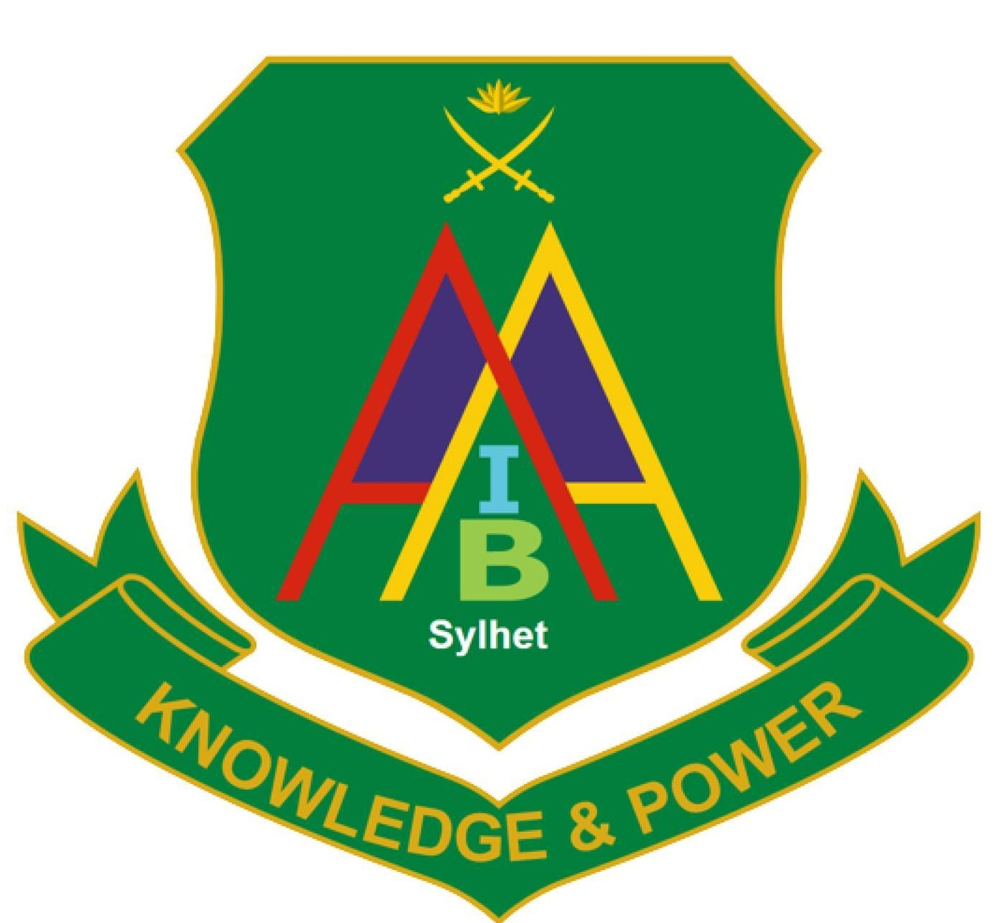

# CRDArmyIBA

<div align="center">
  
  <h2>Centre for Research and Development (CRD)</h2>
  <h4>Army Institute of Business Administration (AIBA), Sylhet</h4>
  <p><strong>Pioneering Rigorous Scholarly Research, Business Strategy, and Multidisciplinary Innovation</strong></p>
</div>

---

## 🏛️ About CRD
The **Centre for Research and Development (CRD)** is the official statutory research and academic publication division of the **Army Institute of Business Administration (AIBA), Sylhet**, Bangladesh. 

CRD provides the institutional architecture for faculty and student scholarship, double-blind peer-reviewed journal publishing, advanced econometric research, and national policy advocacy.

---

## 👥 Institutional Governance & Advisory Board
CRD operates under a strict four-tier institutional hierarchy:

1. **Chief Patron & Institutional Leadership**  
   - **Director**, Army Institute of Business Administration (AIBA), Sylhet
2. **Strategic Academic Advisor**  
   - **Prof. Dr. Munsi Naser Ibn Afzal**, Professor, Department of Economics, Shahjalal University of Science & Technology (SUST)
3. **Acting Head & Academic Coordinator**  
   - **Md Ahsanul Islam (Himel)**, Assistant Professor, Army IBA Sylhet & Managing Editor
4. **Research & Systems Coordination**  
   - **Md Golam Mubasshir Rafi**, Research Assistant & Systems Technical Lead, CRD

---

## 📚 Institutional Journals & Scholarly Infrastructure
- **Jalalabad Papers**: Flagship institutional journal of Army IBA Sylhet (*Vol. 4, Issue 1, 2026*). Bi-annual, peer-reviewed.
- **International Journal of Sustainability and Multidisciplinary Research (IJSMR)**: Internationally indexed multidisciplinary venue.
- **CRD Student Working Paper Series**: Mentored pre-print repository accelerating empirical dissemination.

---

## 🛠️ Technology Stack
- **HTML5 & Vanilla JavaScript**: High performance, zero external framework overhead.
- **CSS3 Custom Design System**: Academic emerald palette (`#1e5a3c`, `#d4af37`, `#0f2d1e`) with responsive grids.
- **Lucide Icons & Web Standards**: Clean vector iconography.
- **Modular Data Architecture**: Clean separation between UI layers and structured datasets (`governance.js`, `publications.js`).

---

## 🚀 Local Development
Serve static files directly or via Node.js:
```bash
node local_server.js
# Access at http://localhost:3000
```

---

## 👨‍💻 Systems & Operations
**Md Golam Mubasshir Rafi**  
Research Assistant & Systems Technical Lead  
Centre for Research and Development (CRD), Army IBA Sylhet  
GitHub: [@gmrafi](https://github.com/gmrafi)
